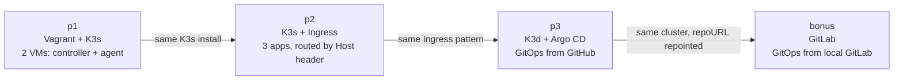

### Learning Material is following this youtube [video](https://www.youtube.com/watch?v=2T86xAtR6Fo)

# Inception-of-Things

The Kubernetes/DevOps project split into four stages. Each stage keeps everything the previous one taught and swaps out exactly one thing — starting with two hand-bootstrapped VMs and ending with a fully self-contained, self-hosted GitOps loop.



## p1 — Two VMs learn to be one cluster
**Tools:** Vagrant · VirtualBox · K3s
Two real virtual machines: `ysakineS` (192.168.56.110) runs K3s in **server/controller** mode, `ysakineSW` (192.168.56.111) runs it in **agent** mode and joins the first over a shared token. The least automated version of "a Kubernetes cluster" — everything here is done by hand, on purpose, to learn what a cluster actually is underneath the tooling.
**Concepts introduced:** Vagrantfile as a VM recipe, controller/agent roles, static private-network IPs, `kubectl`.

## p2 — One cluster learns to route
**Tools:** K3s · Traefik Ingress
Same K3s install, now on a single VM, running three small web apps. New problem: one IP, three destinations — solved with an **Ingress** resource that routes purely on the incoming request's `Host` header (`app1.com` → app1, `app2.com` → app2 with 3 replicas, anything else → app3 by default).
**Concepts introduced:** Ingress rules, Host-header routing, Deployments & replicas, Services.

## p3 — The cluster starts watching Git
**Tools:** K3d · Argo CD · GitHub
The VM disappears — **K3d** runs the whole cluster as Docker containers instead of a VM. And deployment stops being something you do by hand: **Argo CD** watches a GitHub repo's `infra/` folder and continuously reconciles the cluster to match it. Two namespaces: `argocd` (the GitOps controller) and `dev` (the deployed app). Push a new image tag to GitHub, and the app updates itself with no command from you — this is **GitOps**.
**Concepts introduced:** K3d (K3s-in-Docker), GitOps, the Argo CD `Application` resource (`repoURL`/`path`/`targetRevision`/`destination`), automated sync + self-heal.

## bonus — Git moves inside the cluster
**Tools:** GitLab CE · Argo CD (repointed)
The one thing p3 still depended on the outside world for — GitHub — moves in-house. A self-hosted **GitLab** instance runs as its own pod, in its own `gitlab` namespace, inside the *same* k3d cluster. Argo CD's `Application` is repointed from GitHub's URL to GitLab's **internal cluster DNS** (`gitlab.gitlab.svc.cluster.local`) — everything else (the `dev` namespace, the Ingress, the app) is untouched. The result: the exact same GitOps loop as p3, but with zero dependency on the internet.
**Concepts introduced:** self-hosted git server, in-cluster Service DNS, repointing a GitOps source, a fully local CI/CD loop.

### Which concept appears where

| Concept              | p1               | p2            | p3                    | bonus                     |
|-----------------------|------------------|---------------|------------------------|----------------------------|
| VM (Vagrant)          | server + agent   | single VM     | — (containers instead) | —                          |
| K3s / K3d             | K3s              | K3s           | K3d                    | K3d (same cluster)         |
| Namespaces             | default only     | default only  | `argocd`, `dev`        | + `gitlab`                 |
| Ingress / routing      | —                | 3 hosts       | 1 app                  | + `gitlab.localhost`       |
| GitOps (Argo CD)       | —                | —             | watches GitHub         | watches GitLab             |
| Git server              | —                | —             | GitHub (external)      | GitLab (in-cluster)        |

### The point of all four stages

Nothing conceptually new happens after p1 — every later stage applies the same idea (a desired state, declared and reconciled) to a bigger problem. p1 proves a cluster can be bootstrapped by hand; p2 proves it can route real traffic; p3 replaces "by hand" with GitOps; the bonus proves that GitOps loop doesn't need the internet at all. By the end, p3 and the bonus are describable in the same four words — **Argo CD watches a repo** — only *where* that repo lives has moved.

---

# Kubernetes (K8s) Architecture & Concepts

## Introduction
Kubernetes (often abbreviated as K8s) is an open-source container orchestration platform designed to automate the deployment, scaling, and management of containerized applications. It groups containers that make up an application into logical units for easy management and discovery.

## Cluster Architecture
A Kubernetes cluster consists of a set of worker machines, called **nodes**, that run containerized applications. Every cluster has at least one worker node.


The cluster is divided into two main parts:
1.  **Control Plane**: The brain of the cluster. It manages the worker nodes and the Pods in the cluster. In production environments, the control plane usually runs across multiple computers and a cluster usually runs multiple nodes, providing fault-tolerance and high availability.
2.  **Data Plane (Worker Nodes)**: These are the machines (VMs or physical servers) where your actual applications (workloads) run.

## Kubernetes Components
The following diagram illustrates the internal components that make up the Control Plane and the Data Plane.


### Control Plane Components
The Control Plane's components make global decisions about the cluster (for example, scheduling), as well as detecting and responding to cluster events (for example, starting up a new pod when a deployment's replicas field is unsatisfied).

*   **kube-apiserver (API Server)**: The front end for the Kubernetes control plane. It exposes the Kubernetes API. All external communication (CLI, UI) and internal communication between components goes through the API server.
*   **etcd**: Consistent and highly-available key value store used as Kubernetes' backing store for all cluster data. It is the "source of truth" for the cluster state.
*   **kube-scheduler (sched)**: Watches for newly created Pods with no assigned node, and selects a node for them to run on based on resource availability and constraints.
*   **kube-controller-manager (c-m)**: Runs controller processes. Logically, each controller is a separate process, but to reduce complexity, they are all compiled into a single binary and run in a single process. Examples include:
    *   *Node Controller*: Notices and responds when nodes go down.
    *   *Replication Controller*: Maintains the correct number of pods.
*   **cloud-controller-manager (c-c-m)**: Embeds cloud-specific control logic. It lets you link your cluster into your cloud provider's API (like AWS, Azure, GCP) and separates the components that interact with that cloud platform from components that only interact with your cluster.

### Data Plane (Node) Components
Node components run on every node, maintaining running pods and providing the Kubernetes runtime environment.

*   **kubelet**: An agent that runs on each node in the cluster. It makes sure that containers are running in a Pod. It takes a set of PodSpecs and ensures that the containers described in those PodSpecs are running and healthy.
*   **kube-proxy (k-proxy)**: A network proxy that runs on each node in your cluster. It maintains network rules on nodes. These network rules allow network communication to your Pods from network sessions inside or outside of your cluster.
*   **Container Runtime**: The software that is responsible for running containers.

## Cloud Provider Integration
When Kubernetes runs on a cloud provider (like AWS, Azure, or Google Cloud), it can integrate deeply with the underlying infrastructure to provision and manage resources automatically. This is primarily handled by the **Cloud Controller Manager (CCM)**.

### How it works
The CCM separates the Kubernetes control loop from the specific API implementation of a cloud provider. This allows cloud providers to release features at their own pace.

### Key Integration Points
1.  **Load Balancers**: When you define a Kubernetes Service with `type: LoadBalancer`, the CCM communicates with the cloud provider's API to provision a native cloud Load Balancer (e.g., AWS ELB, Azure Load Balancer) that routes traffic to your pods.
2.  **Storage (Persistent Volumes)**: Through the **CSI (Container Storage Interface)**, Kubernetes can dynamically provision cloud-native storage. For instance, requesting a PersistentVolumeClaim (PVC) can automatically create an AWS EBS volume or a Google Persistent Disk and attach it to the correct node.
3.  **Node Lifecycle**:
    *   **Node Controller**: Checks if a node has been deleted in the cloud when it stops sending heartbeats.
    *   **Cluster Autoscaler**: Although often a separate component, it works closely with the cloud provider to add or remove worker nodes (VMs) based on the resource demands of your pods.
4.  **Networking (Routes)**: The Route Controller configures routes in the cloud provider's network infrastructure so that containers on different nodes can communicate with each other.

## Ecosystem & Standards

### CNCF (Cloud Native Computing Foundation)
The **CNCF** is a vendor-neutral home for many of the fastest-growing open source projects, including Kubernetes, Prometheus, and Envoy. It fosters the cloud-native ecosystem and ensures that the technology remains accessible and sustainable.

### Container Runtime & CRI
Kubernetes doesn't run containers directly; it relies on a **Container Runtime**. To make it easy to swap different runtimes, Kubernetes uses the **Container Runtime Interface (CRI)**.
*   **Example**: **containerd** is a popular industry-standard container runtime with an emphasis on simplicity, robustness, and portability. Other examples include CRI-O and Docker Engine (via shim).

### CNI (Container Network Interface)
**CNI** consists of a specification and libraries for writing plugins to configure network interfaces in Linux containers, along with a number of supported plugins. Kubernetes uses CNI plugins to handle networking tasks like assigning IP addresses to Pods and setting up routes.
*   **Examples**: Calico, Flannel, Cilium, Weave Net.

### CSI (Container Storage Interface)
**CSI** is a standard for exposing arbitrary block and file storage systems to containerized workloads on Container Orchestration Systems (COs) like Kubernetes. It allows third-party storage providers to deploy plugins exposing new storage systems in Kubernetes without having to touch the core Kubernetes code.
*   **Examples**: AWS EBS CSI driver, Azure Disk CSI driver, Ceph CSI.

---

## New Concepts Learned

### Namespaces
Namespaces provide logical isolation within a cluster and help organize resources by team, environment, or project.

**Key points:**
- Default namespace is `default` if none specified
- Same resource names can exist in different namespaces
- Useful for separating environments (dev/stage/prod)

**Example:**
```yaml
apiVersion: v1
kind: Pod
metadata:
    name: hello
    namespace: my-apps
```

---

## Project READMEs
- [p1/README.md](p1/README.md)
- [p2/README.MD](p2/README.MD)
- [p3/README.md](p3/README.md)