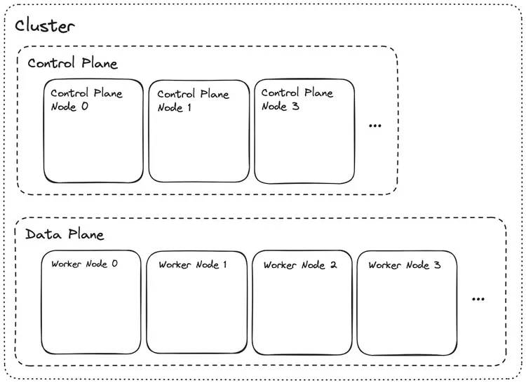
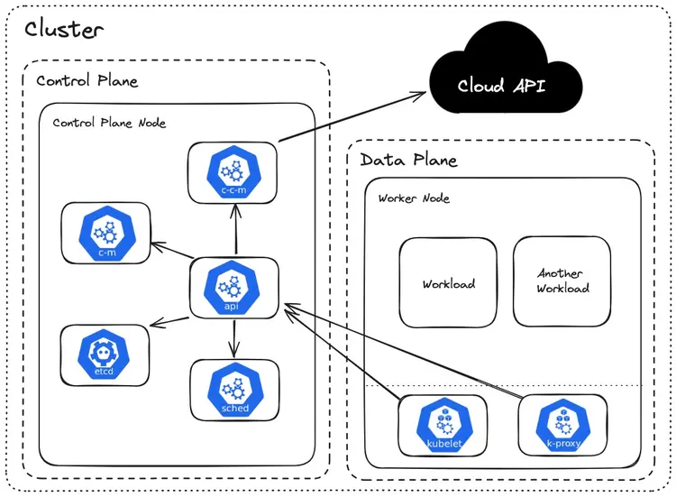

### Learning Material is following this youtube [video](https://www.youtube.com/watch?v=2T86xAtR6Fo)

# Kubernetes (K8s) Architecture & Concepts

## Introduction
Kubernetes (often abbreviated as K8s) is an open-source container orchestration platform designed to automate the deployment, scaling, and management of containerized applications. It groups containers that make up an application into logical units for easy management and discovery.

## Cluster Architecture
A Kubernetes cluster consists of a set of worker machines, called **nodes**, that run containerized applications. Every cluster has at least one worker node.



The cluster is divided into two main parts:
1.  **Control Plane**: The brain of the cluster. It manages the worker nodes and the Pods in the cluster. In production environments, the control plane usually runs across multiple computers and a cluster usually runs multiple nodes, providing fault-tolerance and high availability.
2.  **Data Plane (Worker Nodes)**: These are the machines (VMs or physical servers) where your actual applications (workloads) run.

## Kubernetes Components
The following diagram illustrates the internal components that make up the Control Plane and the Data Plane.



### Control Plane Components
The Control Plane's components make global decisions about the cluster (for example, scheduling), as well as detecting and responding to cluster events (for example, starting up a new pod when a deployment's replicas field is unsatisfied).

*   **kube-apiserver (API Server)**: The front end for the Kubernetes control plane. It exposes the Kubernetes API. All external communication (CLI, UI) and internal communication between components goes through the API server.
*   **etcd**: Consistent and highly-available key value store used as Kubernetes' backing store for all cluster data. It is the "source of truth" for the cluster state.
*   **kube-scheduler (sched)**: Watches for newly created Pods with no assigned node, and selects a node for them to run on based on resource availability and constraints.
*   **kube-controller-manager (c-m)**: Runs controller processes. Logically, each controller is a separate process, but to reduce complexity, they are all compiled into a single binary and run in a single process. Examples include:
    *   *Node Controller*: Notices and responds when nodes go down.
    *   *Replication Controller*: Maintains the correct number of pods.
*   **cloud-controller-manager (c-c-m)**: Embeds cloud-specific control logic. It lets you link your cluster into your cloud provider's API (like AWS, Azure, GCP) and separates the components that interact with that cloud platform from components that only interact with your cluster.

### Data Plane (Node) Components
Node components run on every node, maintaining running pods and providing the Kubernetes runtime environment.

*   **kubelet**: An agent that runs on each node in the cluster. It makes sure that containers are running in a Pod. It takes a set of PodSpecs and ensures that the containers described in those PodSpecs are running and healthy.
*   **kube-proxy (k-proxy)**: A network proxy that runs on each node in your cluster. It maintains network rules on nodes. These network rules allow network communication to your Pods from network sessions inside or outside of your cluster.
*   **Container Runtime**: The software that is responsible for running containers.

## Cloud Provider Integration
When Kubernetes runs on a cloud provider (like AWS, Azure, or Google Cloud), it can integrate deeply with the underlying infrastructure to provision and manage resources automatically. This is primarily handled by the **Cloud Controller Manager (CCM)**.

### How it works
The CCM separates the Kubernetes control loop from the specific API implementation of a cloud provider. This allows cloud providers to release features at their own pace.

### Key Integration Points
1.  **Load Balancers**: When you define a Kubernetes Service with `type: LoadBalancer`, the CCM communicates with the cloud provider's API to provision a native cloud Load Balancer (e.g., AWS ELB, Azure Load Balancer) that routes traffic to your pods.
2.  **Storage (Persistent Volumes)**: Through the **CSI (Container Storage Interface)**, Kubernetes can dynamically provision cloud-native storage. For instance, requesting a PersistentVolumeClaim (PVC) can automatically create an AWS EBS volume or a Google Persistent Disk and attach it to the correct node.
3.  **Node Lifecycle**:
    *   **Node Controller**: Checks if a node has been deleted in the cloud when it stops sending heartbeats.
    *   **Cluster Autoscaler**: Although often a separate component, it works closely with the cloud provider to add or remove worker nodes (VMs) based on the resource demands of your pods.
4.  **Networking (Routes)**: The Route Controller configures routes in the cloud provider's network infrastructure so that containers on different nodes can communicate with each other.

## Ecosystem & Standards

### CNCF (Cloud Native Computing Foundation)
The **CNCF** is a vendor-neutral home for many of the fastest-growing open source projects, including Kubernetes, Prometheus, and Envoy. It fosters the cloud-native ecosystem and ensures that the technology remains accessible and sustainable.

### Container Runtime & CRI
Kubernetes doesn't run containers directly; it relies on a **Container Runtime**. To make it easy to swap different runtimes, Kubernetes uses the **Container Runtime Interface (CRI)**.
*   **Example**: **containerd** is a popular industry-standard container runtime with an emphasis on simplicity, robustness, and portability. Other examples include CRI-O and Docker Engine (via shim).

### CNI (Container Network Interface)
**CNI** consists of a specification and libraries for writing plugins to configure network interfaces in Linux containers, along with a number of supported plugins. Kubernetes uses CNI plugins to handle networking tasks like assigning IP addresses to Pods and setting up routes.
*   **Examples**: Calico, Flannel, Cilium, Weave Net.

### CSI (Container Storage Interface)
**CSI** is a standard for exposing arbitrary block and file storage systems to containerized workloads on Container Orchestration Systems (COs) like Kubernetes. It allows third-party storage providers to deploy plugins exposing new storage systems in Kubernetes without having to touch the core Kubernetes code.
*   **Examples**: AWS EBS CSI driver, Azure Disk CSI driver, Ceph CSI.

---

# Project 2 (p2): Multi-App Deployment with Host-Based Routing

## Architecture

### Traffic Flow
```
External Request → Ingress (Traefik) → Service → Pods (Deployments)
```

**Host-based routing** means traffic is routed to different applications based on the `Host` header:
- `Host: app1.com` → app1-service → app1 pods
- `Host: app2.com` → app2-service → app2 pods (3 replicas with load balancing)
- `Host: app3.com` → app3-service → app3 pods

### Components Deployed

#### 1. Deployments
A **Deployment** is a Kubernetes resource that manages a set of identical Pods. It ensures the desired number of replicas are running and handles rolling updates and rollbacks.

**Key Features:**
- **Replicas**: Number of identical pods to run
- **Self-healing**: Automatically replaces failed pods
- **Load balancing**: Traffic distributed across all healthy replicas
- **Zero-downtime updates**: Rolling updates with configurable strategies

**Our Setup:**
- **app1**: 1 replica
- **app2**: 3 replicas (demonstrates high availability)
- **app3**: 1 replica

When a pod in app2 crashes:
1. Service immediately removes it from the endpoint list
2. Traffic redirects to the remaining 2 healthy pods
3. Deployment controller spawns a replacement pod automatically
4. Once healthy, the new pod is added back to the load balancer pool

#### 2. Services
A **Service** is an abstraction that defines a logical set of Pods and a policy to access them. It provides:
- **Stable IP/DNS**: Pods get new IPs when restarted, Services don't
- **Load balancing**: Distributes traffic across all pods matching the selector
- **Service discovery**: Other pods can find services by name

**Service Types:**
- `ClusterIP` (default): Only accessible within the cluster
- `NodePort`: Exposes on each node's IP at a static port
- `LoadBalancer`: Creates an external load balancer (cloud provider)

**Our Setup:**
- All three services use `ClusterIP` type
- Service exposes port 80
- Traffic forwarded to pod port 5678 (hashicorp/http-echo default)

#### 3. Ingress with Traefik
An **Ingress** is a Kubernetes resource that manages external access to services. It provides:
- **HTTP/HTTPS routing**: Route traffic based on host or path
- **SSL/TLS termination**: Handle certificates centrally
- **Name-based virtual hosting**: Multiple domains on one IP

**Traefik** is the default Ingress controller in K3s. It automatically:
- Detects Ingress resources
- Configures routing rules
- Handles load balancing to services

## File Structure

```
p2/
├── Vagrantfile                    # VM configuration
├── confs/
│   ├── app1.yaml                  # Deployment + Service for app1
│   ├── app2.yaml                  # Deployment (3 replicas) + Service for app2
│   ├── app3.yaml                  # Deployment + Service for app3
│   └── ingress.yaml               # Host-based routing configuration
└── scripts/
    └── install-k3s-server.sh      # K3s installation and app deployment
```

## Key Concepts to Understand

### Labels and Selectors
Labels are key-value pairs attached to resources. Selectors are used to filter resources by labels.

```yaml
# Deployment creates pods with this label
template:
  metadata:
    labels:
      app: app2

# Service routes traffic to pods with this label
selector:
  app: app2
```

### Pod Lifecycle
1. **Pending**: Waiting for scheduler
2. **Running**: All containers started
3. **Succeeded/Failed**: Terminated
4. **Unknown**: Communication lost with node

### Service Discovery
Services get DNS names automatically: `<service-name>.<namespace>.svc.cluster.local`
- Example: `app1-service.default.svc.cluster.local`

### Readiness vs Liveness Probes
- **Liveness**: Restart container if unhealthy
- **Readiness**: Remove from service endpoints if not ready

## Configuration Details

### Deployment Configuration (app2.yaml example)
```yaml
apiVersion: apps/v1
kind: Deployment
metadata:
  name: app2
spec:
  replicas: 3                    # Run 3 identical pods
  selector:
    matchLabels:
      app: app2                  # Manage pods with this label
  template:                      # Pod template
    metadata:
      labels:
        app: app2                # Label applied to each pod
    spec:
      containers:
      - name: app2
        image: hashicorp/http-echo:latest
        args:
          - "-text=Hello from App2"
        ports:
        - containerPort: 5678    # Container listens on 5678
---
apiVersion: v1
kind: Service
metadata:
  name: app2-service
spec:
  selector:
    app: app2                    # Route to pods with this label
  ports:
  - port: 80                     # Service exposed on port 80
    targetPort: 5678             # Forward to container port 5678
```

### Ingress Configuration
```yaml
apiVersion: networking.k8s.io/v1
kind: Ingress
metadata:
  name: apps-ingress
spec:
  rules:
  - host: app1.com               # Match requests with Host: app1.com
    http:
      paths:
      - path: /
        pathType: Prefix
        backend:
          service:
            name: app1-service   # Route to this service
            port:
              number: 80
```

## Setup and Testing

### 1. Deploy the Infrastructure
```bash
cd p2
vagrant up
```

### 2. Access from Host Machine
Add to `/etc/hosts`:
```
192.168.56.110 app1.com
192.168.56.110 app2.com
192.168.56.110 app3.com
```

### 3. Test the Applications
**Using Browser:**
- http://app1.com
- http://app2.com
- http://app3.com

**Using curl:**
```bash
curl -H "Host: app1.com" http://192.168.56.110
curl -H "Host: app2.com" http://192.168.56.110
curl -H "Host: app3.com" http://192.168.56.110
```

### 4. Verify Deployment
SSH into the VM and check resources:
```bash
vagrant ssh

# Check all pods
kubectl get pods -A

# Check deployments
kubectl get deployments

# Check services
kubectl get services

# Check ingress
kubectl get ingress

# Detailed pod info
kubectl describe pod <pod-name>

# View pod logs
kubectl logs <pod-name>

# Test service endpoints
kubectl get endpoints
```

## Common Issues and Troubleshooting

### Issue: "Bad Gateway" Error
**Cause:** Service targetPort doesn't match container port

**Solution:** Ensure `hashicorp/http-echo` uses port 5678:
```yaml
ports:
- containerPort: 5678
---
ports:
- port: 80
  targetPort: 5678  # Must match containerPort
```

### Issue: "serviceaccount 'default' not found"
**Cause:** K3s API server not ready when applying manifests

**Solution:** Wait for API readiness in install script:
```bash
export KUBECONFIG=/etc/rancher/k3s/k3s.yaml
until kubectl get sa default -n default >/dev/null 2>&1; do
  sleep 2
done
```

### Issue: "unknown field 'containers'"
**Cause:** YAML structure error - `containers` must be under `spec`

**Solution:**
```yaml
# Wrong
metadata:
  name: hello-world
containers:  # ❌ Wrong level

# Correct
metadata:
  name: hello-world
spec:
  containers:  # ✅ Under spec
```

### Issue: Pods Not Showing
**Debug steps:**
```bash
# Check all namespaces
kubectl get pods -A

# Check deployment status
kubectl get deployments
kubectl describe deployment app2

# Check events
kubectl get events --sort-by='.lastTimestamp'

# Check service endpoints (should list pod IPs)
kubectl get endpoints app2-service
```

## Key Takeaways

1. **Deployments** manage pods and ensure desired state (replicas, health)
2. **Services** provide stable networking and load balancing
3. **Ingress** handles external routing based on host/path rules
4. **Labels and Selectors** connect deployments, services, and pods
5. **K3s** includes Traefik by default - no separate ingress controller needed
6. **Port mapping**: External (80) → Service (80) → Target (5678) → Container (5678)
7. **High availability**: Multiple replicas automatically load-balanced with failover