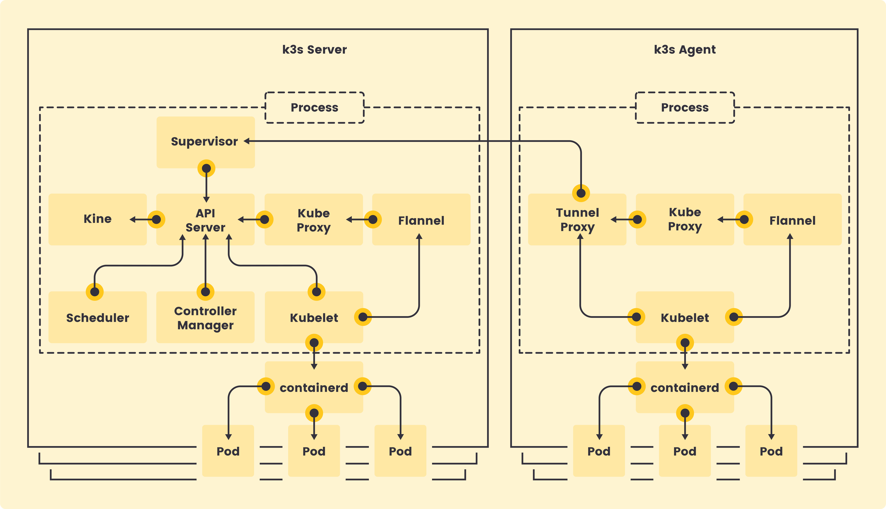

# Part 1 (P1) - Kubernetes Multi-Node Cluster Setup

## Overview
Part 1 sets up a multi-node Kubernetes cluster using K3s running on Ubuntu VMs managed by Vagrant. The goal is to create a k3s server (control plane) and a k3s agent (worker node) to demonstrate a working Kubernetes cluster architecture.

## K3s Architecture



### Server vs Agent

**K3s Server (Control Plane)**
- Runs the full Kubernetes control plane components:
  - **API Server**: Entry point for all Kubernetes API requests
  - **Controller Manager**: Manages cluster state and reconciliation loops
  - **Scheduler**: Assigns pods to nodes based on resource availability
  - **Supervisor**: Manages and monitors all k3s processes
- Stores cluster state in an embedded database (SQLite by default)
- Exposes the Kubernetes API on port 6443
- Can optionally run workloads (pods) when configured with `--disable-agent=false`

**K3s Agent (Worker Node)**
- Runs only the worker components:
  - **Kubelet**: Manages containers and pods on the node
  - **Kube Proxy**: Handles network routing for services
  - **Tunnel Proxy**: Establishes secure tunnel to the server
  - **Flannel**: Provides pod-to-pod networking via VXLAN overlay
- Connects to the server using the API server URL (`https://server:6443`)
- Requires a join token from the server for authentication
- Reports node status and receives workload assignments from the scheduler

### What We're Building
1. **`ysakineS`** - K3s Server node (control plane + worker)
2. **`ysakineSW`** - K3s Agent node (worker only, joins the server)

This creates a 2-node cluster where the server manages the cluster and both nodes can run application workloads.

## Current Setup

### Virtual Machines
- `ysakineS` (server/control plane + can run workloads)
- `ysakineSW` (agent/worker)
- Base box: `ubuntu/bionic64` (Ubuntu 18.04)
- Provider: VirtualBox; resources: 1 vCPU, 1 GB RAM each

### Networking
- NAT adapter (internet): `10.0.2.15`
- Host-only adapter: `192.168.56.0/24`
  - Server IP: `192.168.56.110`
  - Worker IP: `192.168.56.111`
- SSH forward: server 22→1337, worker 22→1338

### Provisioning (now in scripts/)
- `scripts/install-k3s-server.sh`
  - Detects host-only interface/IP, generates random join token, writes to `/vagrant/confs/k3s-token.txt`
  - Installs k3s server bound to the private IP, sets kubeconfig mode 0644
  - Disables ufw, copies kubeconfig to `/home/vagrant/.kube/config` and to `/vagrant/confs/k3s.yaml`
- `scripts/install-k3s-agent.sh`
  - Waits for token file and API reachability, detects worker private IP/interface
  - Installs k3s agent with `K3S_URL=https://192.168.56.110:6443` and the shared token
  - Copies kubeconfig from shared folder to `~/.kube/config` for kubectl without sudo

## How to Use

Start both VMs and reprovision:
```bash
vagrant up --provision
```

Check cluster from the server:
```bash
vagrant ssh ysakineS
kubectl get nodes -o wide
```

Check from the worker (uses shared kubeconfig):
```bash
vagrant ssh ysakineSW
kubectl get nodes -o wide
```

Stop / destroy:
```bash
vagrant halt
vagrant destroy -f
```

## Project Structure
```
p1/
├── Vagrantfile
├── README.md
├── confs/
│   ├── k3s-token.txt        # generated join token (server writes)
│   └── k3s.yaml             # kubeconfig shared to worker
└── scripts/
    ├── install-k3s-server.sh
    └── install-k3s-agent.sh
```

## Notes / TODO
- Current status: two-node cluster provisions; server binds on host-only IP, agent joins via shared token.
- TODO: add health checks/ready-wait in agent for faster failure on bad networking; optional ufw rules if re-enabled; adjust resources if workloads need more than 1 vCPU/1 GB.
